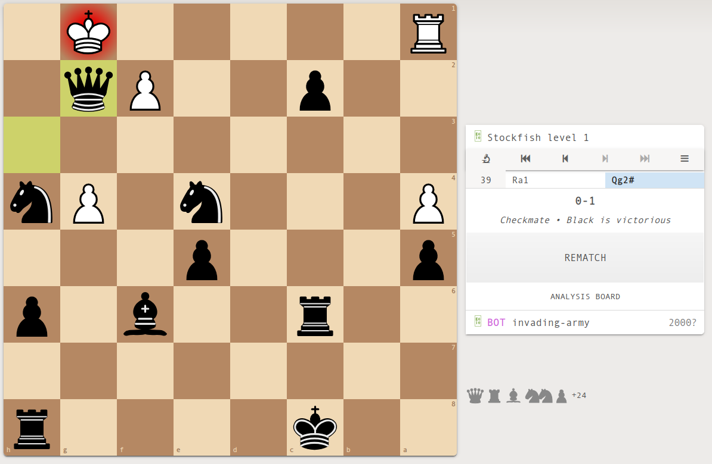

### Fails
This awesome game where my bot was whooping sf 1
```
e2e4 c7c6 b1c3 d7d6 d2d4 e7e6 c1f4 f7f6 g1f3 a7a6 d1c1 b7b6 f4g3 g7g6 h2h4 h7h6 c1e3 a6a5 e1c1 b6b5 f1d3 c6c5 c1b1 c5d4 e3d4 b8c6 a2a3 c6d4 h1e1 d4f3 e1e2 f3d4 e2e3 d4f3 c3b5 f3d2 b1a1 d6d5 e4d5 d8d5 b5d6 f8d6 g3d6 d5d6 a1a2 d6d5 c2c4 d5g2 d3g6 g2g6 e3e6 c8e6 a3a4 d2c4 d1d4 g6f5 d4c4 f5f2 a2b3 f2h4 b3a3 h4d4 a3a2 f6f5 a2a3 g8f6 c4c8```

ended in an illegal move h6h5

### Win
This feels damn good. The bot starts the game by bringing pawns onward right now but it's good, still beat sf1.
